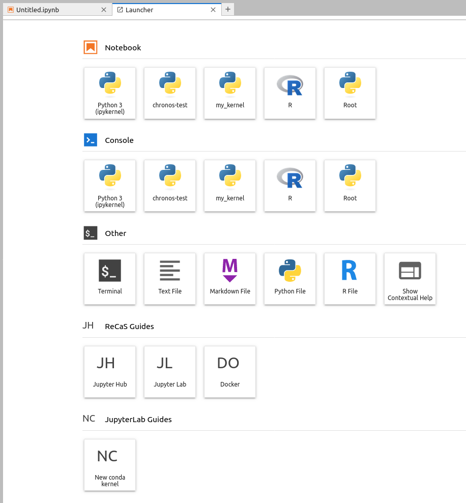
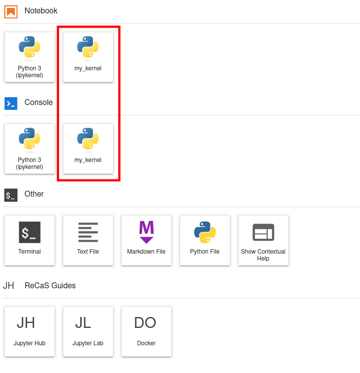
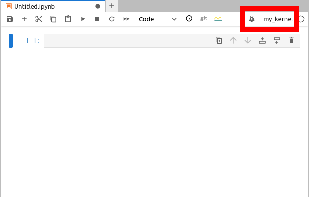

#Jupyter Lab Guide

*Updated on 15Mar2024*

## 0 User Support
If you need support for your application, please use this [link](https://www.recas-bari.it/index.php/en/recas-bari-servizi-en/support-request) to create a ticket with title “ReCaS HPC/GPU: Jupyter Lab support” and then describe your issue. 

Please provides all needed information to make easier the solution of you situation, like notebook absolute path, screenshot, and so on. 


**It is STRONGLY advised to subscribe to the recas-hpu-gpu mailing list. Create a ticket with the title “ReCaS HPC/GPU: subscribe to the mailing list”.**

## 1 Introduction
Jupyter Labs are open-source web applications that allows you to create and share documents that contain live code, equations, visualizations and narrative text.
Uses include: data cleaning and transformation, numerical simulation, statistical modelling, data visualization, machine learning, and much more.

The ReCaS Jupyter Lab can access your files and directories stored in the ReCaS-Bari storage (based on GPFS distributed file system) and use high performance GPUs to speed up the execution of your application. 

The ReCaS Jupyter Lab instances are based on the [RAPIDS Docker container](https://hub.docker.com/r/rapidsai/rapidsai/).

## 2 JupyterLab Launcher

This is the last launcher version, implemented in ReCaS-Bari JupyterHub



### 2.1 Jupyter Kernels

In the first two rows you have all available kernels in your JupyterLab instance.

Beyond Python3 kernel, you will find other two kernels: R and Root kernels.

#### R kernel
This kernel enables the writing and the execution of simple R codes. 

#### Root kernel
This kernel enables the writing and the execution of simple root codes. 

Some issues related to the Python binding are known. 

You can use the root in interactive mode using the terminal, after activated the conda environment using the following command:

`conda activate root_kernel`

### 2.2 Utilities

In the third row, you have some utilities, like Terminal (you can use it to execute bash command in the bash shell), text, markdown, python and R file editor.

### 2.3 ReCaS-Bari Services Guides

In the bottom rows you will find links to guides for all ReCaS-Bari GPU-cluster services.

## 3 Installing new Python modules

### 3.1 pip

`pip` can be used to install new Python packages. 

Specific lines can be put inside the code, like followings:

```python
# Installation
%pip install graphviz

# Import 
import graphviz
```

!!! warning 
	Remember to put a `%` before the `pip install` command: in this way the python module is directly available in the kernel. Otherwise restart the kernel to use the installed packages.

There is a drawback to use `pip install`: when your JupyterLab instance is restarted you will lose all installed Python modules.

### 3.2 conda

Alternately you can use also `conda` and install packages using the Terminal. To use the terminal in JupyterLab, open a new tab and select `Terminal` from the launcher.

The following lines show how to install `pandas` package in a new conda environment :

```bash
conda create --name my_kernel pandas=2 -y
conda activate my_kernel
```

After the second command, you will notice appearing the `(my_kernel)` in the shell.

To test the installation, execute the following command

```bash
python -c 'import pandas; print(pandas.__version__)'
```

Conda will install the Python modules you need for your code/project in your Home directory in `/lustrehome`, enabling multiple advantages:

- your conda environment is always available even if your JupyterLab instanza (aka container) is restarted

- You can create a new Jupyter kernel, so that a notebook could be executed inside a given conda environment

- It is the first step to submit a notebook to the GPU-cluster in order to execute it in batch

!!! note
    Consider `conda` as first option.

### 3.2.1 Troubleshooting

#### conda init
If conda shows you an "conda init" error, execute the command `conda init` and then execute the command:

```bash
source /lustrehome/<username>/.bashrc
```

#### base conda environment
You cannot install python packages in the `base` conda environment, you have to create a new one as described [above](https://jvino.github.io/cluster-hpc-gpu-guides/guides/jupyter-lab/#32-conda)

### 3.2.2 Create new Jupyter kernel    
    
Starting from a conda environment it is possible to create a Jupyter kernel: this will make easier to execute a given notebook using a particular conda environment.

Following some commands to create a conda environment and how to create a jupyter kernel linked to it:

```bash
conda create --name my_kernel -c conda-forge pandas=2 ipykernel -y
conda activate my_kernel
python -m ipykernel install --name my_kernel --user --display-name my_kernel
```

Remind to reload the browser in order to see your new kernel in the Jupyter launcher.



Once the kernel appears in the launcher, it is possible to select it inside the notebook, as shown in the following image.



## 4 Upload file from local file system

To upload files from your local file system to the JupyterLab workspace, press the button shown in the following figure and select the files to would like to upload.


## 5 Enable Resource Usage Dashboards

The ReCaS Jupyter Lab gives you the possibility to monitor the resource usage of your application in real-time. 

Few simple steps are needed to build your personal dashboard.

First, click in the third tab on the left, named "System Dashboards", as shown in the following figure.


Second, double click on the favorite blue button and it will be places as a tab, near the notebook one.
Grab and move it and select your favorite position.

In the following figure it is shown the "Machine Resources" plots.


Additional plots can be put on the screen.

In the following figure it is shown also the "GPU Resources" plots.


## 6 Dask

Dask is a flexible open-source Python library for parallel computing. Dask scales Python code from multi-core local machines to large distributed clusters in the cloud. Dask provides a familiar user interface by mirroring the APIs of other libraries in the PyData ecosystem including: `Pandas`, `Scikit-learn` and `NumPy`. It also exposes low-level APIs that help programmers run custom algorithms in parallel. (Wikipedia)

Dask gives the possibility to split the workload among multiple workers. 
So the first step concerns the creation of a cluster. 
Workers can be executed on different machines or on the same machine.

### 6.1 Start a new Dask cluster

The easiest way to create a Dask cluster is through the following lines:

```python
from dask.distributed import Client, LocalCluster
cluster = LocalCluster()  # Launches a scheduler and workers locally
client = Client(cluster)  # Connect to distributed cluster and override default
```

After that, computation on Dask DataFrames can be executed. 

In the following line is shown the evaluation of the sum of the column `x` of the dataframe `df`.

```python
df.x.sum().compute()  # This now runs on the distributed system
```

It is recommended to read the [official Dask guide](https://distributed.dask.org/en/stable/quickstart.html) to learn all provided capabilities.

### 6.2 Enable Dask Resource Usage Dashboards

Dash provides additional graphical objects to monitor in real-time application information like resource usage and application progress.

Firstly, the creation of a Dask cluster through the Jupyter Lab interface. 

This is done by selecting the forth tabs on the left, the `Dask` Tab, and create a new cluster by clicking on the `NEW` button, as shown in the following figure.


Secondly, the importing of the created cluster in the code.

This is easily done by clicking the `< >` button on the bottom left after having selected the cell inside the notebook, as shown in the following figure.


Following it is copied the generated code for convenience.

```python
from dask.distributed import Client

client = Client("tcp://127.0.0.1:44359")
client

```

Multiple Dask graphical objects can be enabled and moved inside the window.

If the code exploit Dask objects, during its execution the information about the application (resources usage, application progress, ...) are shown in real-time, as shown in the following figure.


## 7 Bash process management

Your JupyterLab instace is started on a Linux Operative System. 

Learn how to interact with its Process management it is important to manage aspects of your application executions. 

Please, take a look of the most important commands that you will find useful. 

[Link](https://linuxsimply.com/bash-scripting-tutorial/process-and-signal-handling/process-management/)


## 8 Execute a Jupyter Notebook in background with papermill

Papermill is a tool for parameterizing and executing Jupyter Notebooks.

Papermill lets you:

 - parameterize notebooks
 
 - execute notebooks

Papermill is already installed on your JupyterLab instance.

If you would like to use `papermill` also in your conda environment, please install it using the following command

```bash
conda install -c conda-forge papermill -y
```

Please task a look of the [official documentation](https://papermill.readthedocs.io/en/latest/).

## 9 RAPIDS

The RAPIDS suite of open source software libraries gives you the freedom to execute end-to-end data science and analytics pipelines entirely on GPUs. 

Seamlessly scale from GPU workstations to multi-GPU servers and multi-node clusters with Dask.

Accelerate your Python data science toolchain with minimal code changes and no new tools to learn.

RAPIDS is an open source project. Supported by NVIDIA, it also relies on Numba, Apache Arrow, and many more open source projects. 

[Reference](https://rapids.ai/)

## 8 Useful links

[Dask Webpage](https://www.dask.org/)

[Dask GitHub page](https://github.com/dask/dask)

[RAPIDS Webpage](https://rapids.ai/)

[RAPIDS Docker container Webpage](https://hub.docker.com/r/rapidsai/rapidsai/)
