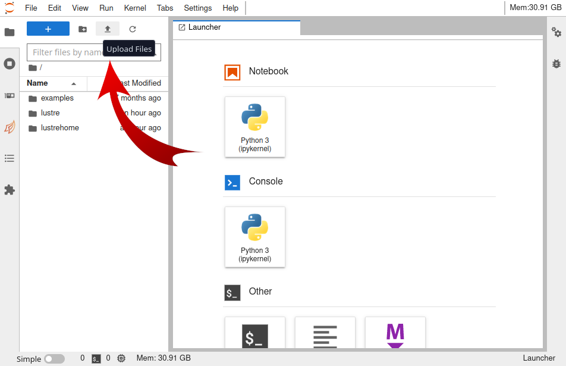
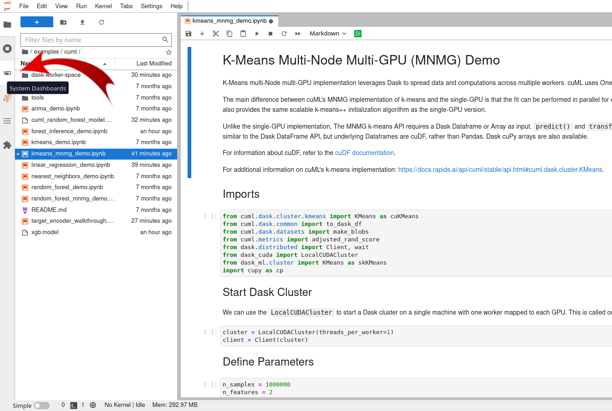
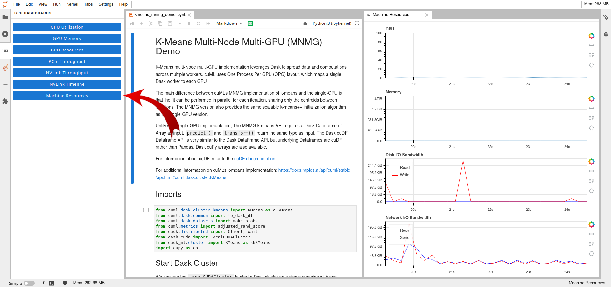
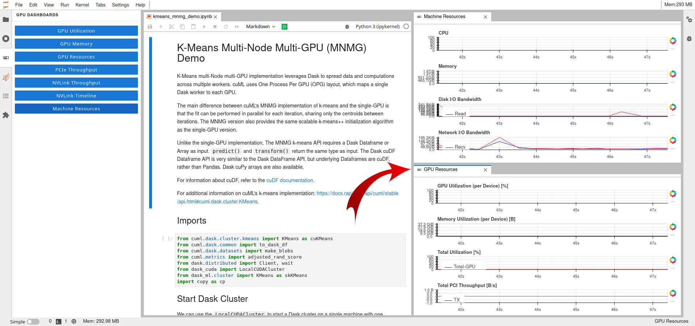
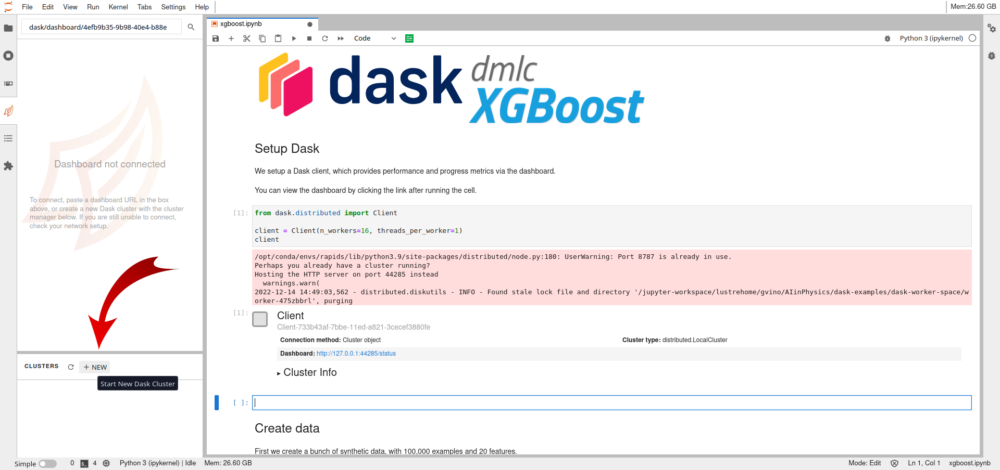
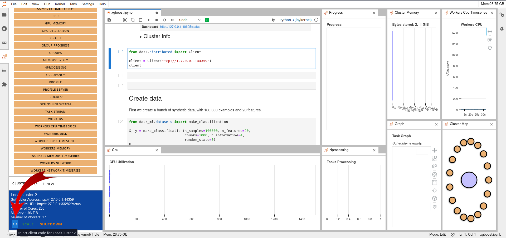
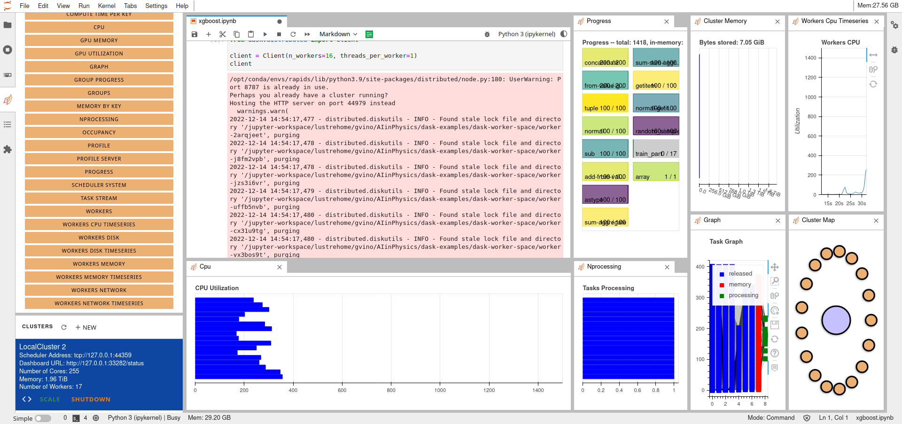

#Jupyter Lab Guide

*Updated on 12Dic2022*

## 0 User Support
If you need support for your application, please use this [link](https://www.recas-bari.it/index.php/en/recas-bari-servizi-en/support-request) to create a ticket with title “ReCaS HPC/GPU: Jupyter Lab support” and then describe your issue.


**It is STRONGLY advised to subscribe to the recas-hpu-gpu mailing list. Create a ticket with the title “ReCaS HPC/GPU: subscribe to the mailing list”.**

## 1 Introduction
Jupyter Labs are open-source web applications that allows you to create and share documents that contain live code, equations, visualizations and narrative text.
Uses include: data cleaning and transformation, numerical simulation, statistical modelling, data visualization, machine learning, and much more.

The ReCaS Jupyter Lab can access your files and directories stored in the ReCaS-Bari storage (based on GPFS distributed file system) and use high performance GPUs to speed up the execution of your application. 

The ReCaS Jupyter Lab instances are based on the [RAPIDS Docker container](https://hub.docker.com/r/rapidsai/rapidsai/).

## 2 Installing new Python modules
`pip` can be used to install new Python packages. 

Specific lines can be put inside the code, like followings:

```python
# Installation
! pip install graphviz

# Import 
import graphviz
```

!!! warning 
	Remember to put a `!` before the command. 

Alternately you can use also `conda` (environment named `rapids`) and install packages using the Terminal (you can access to it by opening a new Lancher and selecting `Terminal`). 

The following lines show how to install `mysql` package:

```bash
conda activate rapids
conda install -y mysql
```

After the installation, return in the notebook and type  `import mysql`.

!!! note
    Consider `pip` as first option.

## 3 Upload file from local file system

To Upload files from your local file system to the JupyterLab workspace, press the button shown in the following figure and select the files to would like to upload.



## 4 Enable Resource Usage Dashboards

The ReCaS Jupyter Lab gives you the possibility to monitor in real-time the resource usage of your application. 

Few simple steps are needed to build your personal dashboard.

First, click in the third tab on the left, named "System Dashboards", as shown in the following figure.



Second, double click on the favorite blue button and it will be enabled. 

The plot will be placed as tab, near the notebook tab: you can grab it and select your favorite position.
, they will be put on a tab close to the one of the code.

There is the possibility to move it in order to create a separate window.

In the following figure it is shown the "Machine Resources" plots.



Additional plots can be put on the screen.

In the following figure it is shown also the "GPU Resources" plots.



## 5 Dask

Dask is a flexible open-source Python library for parallel computing. Dask scales Python code from multi-core local machines to large distributed clusters in the cloud. Dask provides a familiar user interface by mirroring the APIs of other libraries in the PyData ecosystem including: `Pandas`, `Scikit-learn` and `NumPy`. It also exposes low-level APIs that help programmers run custom algorithms in parallel. (From Wikipedia)

### 5.1 Start Dask cluster

The easiest way to deploy a Dask cluster is through the following lines:

```python
from dask.distributed import Client, LocalCluster
cluster = LocalCluster()  # Launches a scheduler and workers locally
client = Client(cluster)  # Connect to distributed cluster and override default
```

Then computation on Dask DataFrame can be executed.  

```python
df.x.sum().compute()  # This now runs on the distributed system
```

This guide can not replace the [official Dask guide](https://distributed.dask.org/en/stable/quickstart.html), that is recommended to be read.

### 5.2 Enable Dask Resource Usage Dashboards

In order to plot some useful information regarding the execution of the code, it is important to create the Dask cluster through the Jupyter Lab interface. 

By selecting the forth tabs on the left, the `Dask Tab`, you have the possibility to create a new cluster by clicking on the new button, as shown in the following figure.



The second step consist of to import the created cluster in the code.

This is easily done by clicking the `< >` button on the bottom left, as shown in the following figure, after having selected the cell inside the notebook.



Running a code exploiting Dask object, multiple plots can be put inside the windows, showing the progress of the applcation, as shown in the following figure.



## 6 Useful links

[Dask Webpage](https://www.dask.org/)

[Dask GitHub page](https://github.com/dask/dask)

[RAPIDS Webpage](https://rapids.ai/)

[RAPIDS Docker container Webpage](https://hub.docker.com/r/rapidsai/rapidsai/)