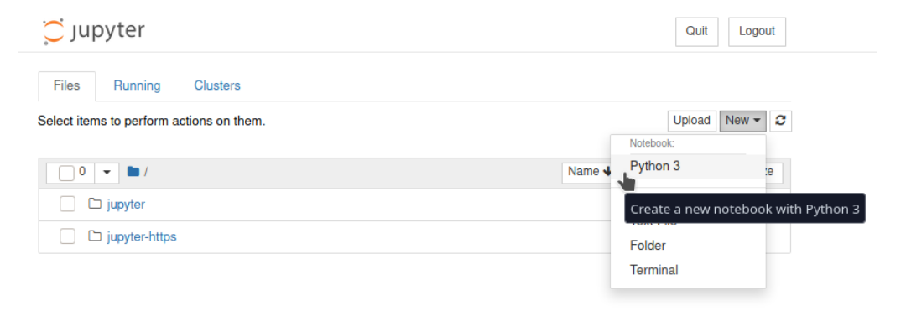

#JupyterNotebook

*Updated on 15Apr2022*

## 1 Introduction
The Jupyter Notebook is an open-source web application that allows you to create and share documents that contain live code, equations, visualisations and narrative text.
Uses include: data cleaning and transformation, numerical simulation, statistical modelling, data visualisation, machine learning, and much more.
Through Jupyter Notebook, you can access your files and directories stored in the ReCaS-Bari GPFS file system and browse graphically, as shown in the following figure.


To create a new notebook with Python 3, click on “New” and then select “Python 3”, as shown in the following figure.



Finally, the Integrated Development Environment (IDE) is opened, as shown in the figure.


## 2 Service concession
The Jupyter Notebook instance MUST BE used ONLY for the developing phase. As soon as the code/analysis works, users are encouraged to use the [Job Orchestration service](https://jvino.github.io/cluster-hpc-gpu-guides/job_submission/chronos/).

**IMPORTANT:** Every Jupyter Notebook instance on HPC/GPU cluster is allowed ONLY for a month. After, the instance will be killed. An email will be sent a week before. To extend the period of usage, create a ticket using this [link](https://www.recas-bari.it/index.php/en/recas-bari-servizi-en/support-request) with title “ReCaS HPC/GPU: Jupyter Notebook instance - Time extension request” and describe a valid reason for extension of time.

## 3 Service request
Jupyter Notebook on HPC/GPU cluster is available only for those users with a ReCaS-Bari HPC/HTC account active. Users without such an account MUST register using this [link](https://www.recas-bari.it/index.php/en/recas-bari-servizi-en/richiesta-credenziali-2) (check the box "**Account for access to ReCas-Bari compute services (HTC/HPC)**").

You can check if the registration is successfully completed by access to the **frontend.recas.ba.infn.it** server via ssh:

`ssh <username>@frontend.recas.ba.infn.it`

After that, you can request your personal Jupyter Notebook instance using this [link](https://www.recas-bari.it/index.php/en/recas-bari-servizi-en/support-request).

Please provide the following information:
```bash
Title: “ReCaS HPC/GPU: Jupyter Notebook instance request”
Issue:
- Name and Surname
- Username
- Email
- number of required CPU
- number of required GPU
- amount of RAM
- hashed password
- other info, if you believe could be useful (like python version)
```

Once the request will be approved, you will receive an email containing your URL to use to access the remote Jupyter Notebook.

In the following image, you can see the login web page. Insert your password used during the creation of hashed password (Next section).


**IMPORTANT:** DO NOT SHARE your password. People knowing hostname, port and password have access to your home directory with delete permission.

### 3.1 Preparing a hashed password
You can prepare a hashed password manually.

Open a shell, install the notebook python module (pip3 install notebook) and type the following lines in a python shell:

```bash
[root@your-machine ~]# python3
\>>> from notebook.auth import passwd
\>>> passwd()
Enter password:
Verify password:
'argon2:$argon2id$v=19$m=10240,t=10,p=8$+Gzqn+ZgyvjrXo9eJTIe3w$z0fzG6RZgSbcSXkCAYb3vw'
```

Finally, save the string 'argon2:$argon2id$v=19$m=10240,t=10,p=8$+Gzqn+ZgyvjrXo9eJTIe3w$z0fzG6RZgSbcSXkCAYb3vw'

And provide it among the required information.

For reference, the [official web page](https://jupyter-notebook.readthedocs.io/en/stable/public_server.html#preparing-a-hashed-password).

### 3.2 General suggestions
Please identify only the resource you need (we don't have infinite resources for all users!).

## 4 Notebook tips
### 4.1 General information
PAY ATTENTION: your instance of Jupyter notebook is executed inside a container and **ONLY** the files stored in your HOME directory in the ReCaS-Bari GPFS file system will be preserved if faults occur, namely /lustrehome. Any local file content or module installation are lost if the container is stopped or crashes. So, use the GPFS file system for all your important files.

**Containers could crash at any time also during the execution of the code**, partial results CAN NOT be restored and will be lost. To manage this situation, consider storing in your HOME directory in GPFS all partial results.

Also consider that you do not have infinite space in the GPFS file system. Use it wisely.

### 4.2 Install python modules

To install python modules directly inside the code is needed to add some lines at the beginning.

Following lines install multiple modules inside the jupyter notebook and then import all of them. Replace `<user>` with your username.

```bash
import sys
if not '/home/<user>/.local/lib/python3.6/site-packages' in sys.path:
`	`sys.path.append('/home/<user>/.local/lib/python3.6/site-packages')

!{sys.executable} -m pip install opencv-python-headless
!{sys.executable} -m pip install seaborn
!{sys.executable} -m pip install keras
!{sys.executable} -m pip install scipy
!{sys.executable} -m pip install pandas
!{sys.executable} -m pip install scikit-learn
!{sys.executable} -m pip install matplotlib
import cv2
import sql
import seaborn
import keras
import scipy
import pandas
import sklearn
import matplotlib.pyplot as plt
```

## 5 User Support
If you need support for your application, please use this [link](https://www.recas-bari.it/index.php/en/recas-bari-servizi-en/support-request) to create a ticket with title “ReCaS HPC/GPU: Jupyter Notebook support” and then describe your issue.

!!! tip
    It is STRONGLY advised to subscribe to the recas-hpu-gpu mailing list. Create a ticket with the title “ReCaS HPC/GPU: subscribe to the mailing list”.
