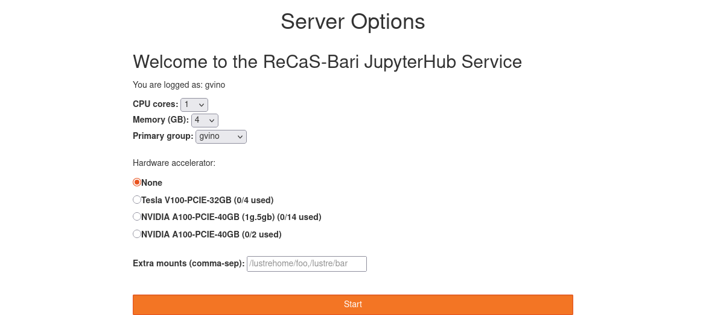
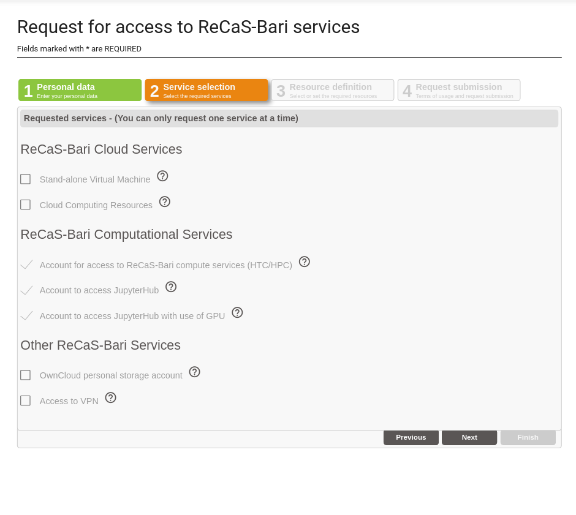

#JupyterHub for ReCaS users

*Updated on 19 May 2025*

## IMPORTANT: User Support
If you need support for your application, please use this [link](https://www.recas-bari.it/index.php/en/recas-bari-servizi-en/support-request) to create a ticket with title “ReCaS HPC/GPU: JupyterHub support” and then describe your issue.

**It is STRONGLY advised to subscribe to the recas-hpu-gpu mailing list. Create a ticket with the title “ReCaS HPC/GPU: subscribe to the mailing list”.**

Important messages will be sent ONLY using the mailing list.

## 1) Introduction
The ReCaS JupyterHub provides JupyterLab instances for ReCaS users. JupyterLabs are open-source web applications that allow you to create and share documents that contain live code, equations, visualisations, and narrative text.
Uses include: data cleaning and transformation, numerical simulation, statistical modelling, data visualisation, machine learning, and much more.

JupyterLab instances served through this service can access your files and directories stored in the ReCaS-Bari storage (based on the GPFS distributed file system) and use high-performance GPUs to speed up the execution of your application.

Only registered users can access this service. In the request section, you can find information on how to request the service.

## 2) Access to the service
The ReCaS JupyterHub service provides JupyterLab instances with or without GPU Hardware Accelerators, depending on whether you are authorized to use them.

To access the ReCaS JupyterHub service, use the link [https://hub.recas.ba.infn.it](https://hub.recas.ba.infn.it)

!!! note
    You may need to "Clear cookies and site data".

Users authorized to use a JupyterLab instance with a GPU will only be provided with a Virtual GPU.

Those interested in using a whole GPU must provide a STRONG motivation.

Once you have clicked on the link, the authentication page will be shown:

Here you should enter your personal username and password, created during the registration phase.

## 3) Configuration section

After authenticated, you will have the possibility to configure your jupyterLab instance. The following image shows the configuration page.

As you can see, you can configure the following fields.

### 3.1) CPUs

Here you can select the number of CPUs you want to associate with your JupyterLab instance.
The available choices are: 1, 4, 8, and 16.
If you select a number of CPUs greater than 1, ensure that your code is able to use a multicore architecture; otherwise, your application will use only one CPU.

If you don't know what to select, choose 1 CPU. You can always change it later.

### 3.2) Memory (RAM)

Here you can select the amount of RAM memory you want to associate with your JupyterLab instance.
The available choices are: 4, 8, 16, and 32 GB.
You should select the minimum value that allows your application to run.

If you don't know what to select, choose 8 GB. You can always change it later.

### 3.3) User group

Users can have multiple groups, for example, because they collaborate with different teams (each with its own team directory).

When users want their JupyterLab instance to be able to read/write files in these shared directories, the corresponding team group should be selected.

If you don't know what to select, just leave the default value.

### 3.4) GPU

You will see this section only if you are allowed to use a GPU.
Currently, only GPUs with a dedicated memory of 5GB are available. If your application requires a more powerful GPU, please open a ticket with the title “ReCaS HPC/GPU: JupyterHub with powerful GPU” where you can explain the reasons you need a more powerful GPU.
You should select a GPU only if your application is able to use it.

The image shows that you can select different GPU models and how many of them are currently in use. You will only see GPU models you have been authorized to use.

Only authorized users can select a GPU; please see below how to request one.

### 3.5) Additional paths to mount

By default, your personal home directory (usually `/lustrehome/{username}`) is mounted AUTOMATICALLY inside your JupyterLab instance. **DO NOT INSERT YOUR PERSONAL HOME DIRECTORY HERE**.

This configuration section allows you to mount additional and **ALREADY CREATED** directories, such as those used for sharing files in a team.

Multiple paths can be inserted in this field, but they should be separated by commas with no spaces, e.g., `/lustre/path1,/lustre/path2`.

!!! note
    These configuration fields are not permanent and can be changed.
    To do that, delete your instance and request a new one using the new configuration.
    Please see below how to delete your instance and create a new one.

## 4) JupyterLab

Once the configuration phase is complete, the JupyterLab instance is launched.
After its initialization, the following image shows the interface you will see.

There is a dedicated guide for JupyterLab, accessible at this [link](https://jvino.github.io/cluster-hpc-gpu-guides/guides/jupyter-lab/).

## 5) Deleting your Jupyter instance

**The ReCaS datacenter does not have infinite resources.**

We appreciate it if you delete your Jupyter instance when you know you won't be using it for a while.
When you need to use it, you can request a new one with a couple of clicks!
You can also remove it if you want to change the instance configuration, for example, if you want to add more resources to it.

To remove your Jupyter instance, access `Files -> Hub Control Panel` as shown in the following image:

And then click the `Stop My Server` red button.

After a few seconds, your instance will be deleted.
To request a new one, click the `Start My Server` blue button.

## 6) Additional information

Each Jupyter instance is configured to be deleted **automatically** if you don't use it for at least a day.

Please save all important files in your GPFS directories.

Your Jupyter instance runs inside a container, and **ONLY** the files stored in directories in the ReCaS-Bari GPFS file system will be preserved, namely `/lustrehome/{username}` or `/lustre/{some-directory}`. Any local file content or module installations are lost if the container is stopped or crashes. Therefore, use the GPFS file system for all your important files.

**Containers could crash at any time, even during code execution.** Partial results CANNOT be restored and will be lost. To manage this situation, consider storing all partial results in your HOME directory in GPFS.

Also, consider that you do not have infinite space in the GPFS file system. Use it wisely.

Deleting files using JupyterLab will create a hidden folder named *.Trash* in your HOME directory. To completely remove files, please access `frontend.recas.ba.infn.it` using SSH. The content of the *.Trash* folder contributes to your quota.

## 7) Service request
JupyterLab on the HPC/GPU cluster is available only to users with an **active ReCaS-Bari HPC/HTC account** and **JupyterHub service enabled**. Both can be requested via this [link](https://www.recas-bari.it/index.php/en/recas-bari-servizi-en/richiesta-credenziali-2).

In the following image, you can see how to request the ReCaS account, access to JupyterHub, and access to the GPU.

Access to JupyterHub is for everyone with a ReCaS account.

**The use of GPUs is restricted only to those with a STRONG motivation.**

You can check if the registration is successfully completed by connecting to the `frontend.recas.ba.infn.it` server via ssh:

`ssh <username>@frontend.recas.ba.infn.it`

After that, you can request your personal JupyterLab instance via this [link](https://www.recas-bari.it/index.php/en/recas-bari-servizi-en/support-request).
