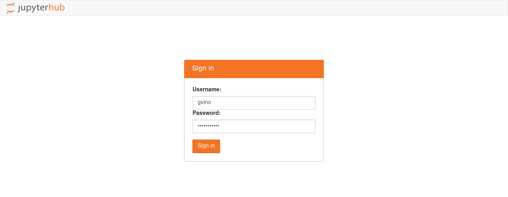
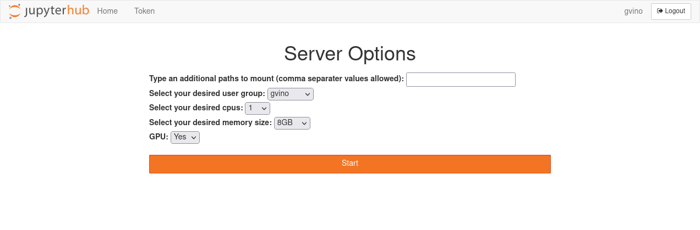
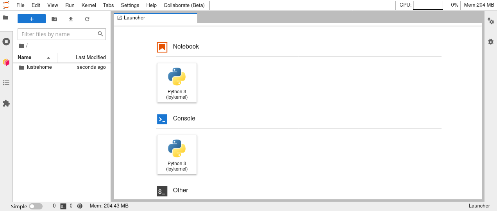
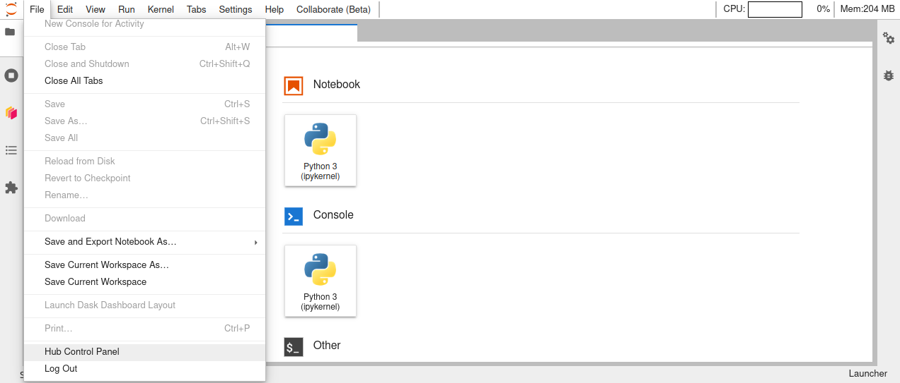
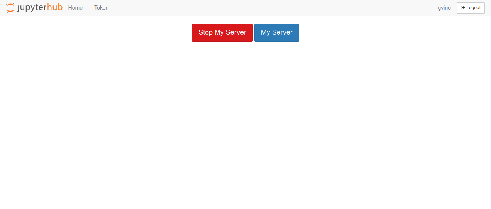

#JupyterHub for ReCaS users

*Updated on 25Jul2023*

## IMPORTANT: User Support
If you need support for your application, please use this [link](https://www.recas-bari.it/index.php/en/recas-bari-servizi-en/support-request) to create a ticket with title “ReCaS HPC/GPU: Jupyter support” and then describe your issue.

**It is STRONGLY advised to subscribe to the recas-hpu-gpu mailing list. Create a ticket with the title “ReCaS HPC/GPU: subscribe to the mailing list”.**

Important messages will be sent ONLY using the mailing list.

## 1) Introduction
The ReCaS JupyterHub provides Jupyter Lab instances for the ReCaS users. Jupyter Labs are open-source web applications that allows you to create and share documents that contain live code, equations, visualisations and narrative text.
Uses include: data cleaning and transformation, numerical simulation, statistical modelling, data visualisation, machine learning, and much more.

Jupyter Lab served through this service can access your files and directories stored in the ReCaS-Bari storage (based on GPFS distributed file system) and use high performance GPUs to speed up the execution of your application. 

Only registered users can access to this service. In the request section you can find information how to request the service.

## 2) Access to the service

The ReCaS JupyterHub service provides a JupyterLab instance:

- with GPU, accessible at this [link](https://hpc.recas.ba.infn.it:10001/)

- with NO GPU, accessible at this [link](https://hpc.recas.ba.infn.it:10002/)

JupyterLab instances with NO GPU are available for those belonging a ReCaS account.

JupyterLab instances with GPU are available for those belonging a ReCaS account and a STRONG motivation to use a GPU.

Once clicked on the link, you will see the authentication page, shown in the following image:

Here you should insert your personal username and password, created during the registration phase.

## 3) Configuration section

After authenticated, you will have the possibility to configure your jupyterLab instance. The following image shows the configuration page.

As you can see, you have the possibility to configure 5 fields.

### 3.1) Additional paths to mount

By default your personal home directory (usually `/lustrehome/{username}`) is mounted inside your Jupyter Lab instance. 

This configuration section allows you to mount additional and **ALREADY CREATED** directories, like those used to shared files in a team. 

Multiple paths can be inserted in this field but they should be separeted using the comma without spaces, e.g. `/lustre/path1,/lustre/path2`. 

### 3.2) User group

Users can have multiple groups, for example because collaborate with different teams (each having own team directory).

When users want their Jupyter Lab instance can read/write files in this shared directories, the corresponding team group should be selected.

If you don't know what select, just leave the default value.

### 3.3) CPUs

Here you can select the number of cpus you want associate with your Jupyter Lab instance. 
The available choices are: 1, 2, 4, 8 and 16.
If you select a number of cpus greater than 1 ensure that your code is able to use a multicore architecture, otherwise your application will use only 1 cpu. 

If you don't know what select, select 1 cpu. You have always to change it later. 

### 3.4) Memory (RAM)

Here you can select the amount of RAM memory you want associate with your Jupyter Lab instance. 
The available choices are: 8, 16 and 32 GB.
You should select the mininum value that allow your application to run.

If you don't know what select, select 8 GB. You have always to change it later. 

### 3.5) GPU

You can select to add a GPU to your instance. 
In this moment only GPU with a dedicated memory of 5GB are available. In the case your application requires a more powerful GPU, please open a ticket with the title “ReCaS HPC/GPU: Jupyter with powerful GPU” where you can explain the reasons you need a more powerful GPU.
You should select the GPU only if your application is able to use it. 

Only authorized users can select a GPU, please see below how to request one.

### 3.6) Change configurations

These configuration fields are not permanent and can be changed.
To do that, delete your instance and request a new one using the new configuration.
Please, see below how to delete your instance and create a new one.

## 4) JupyterLab

As soon as the configuration phase is terminated, the Jupyter Lab instance is launched. 
After its initialization, the following image shows you the interface you will see.

There is a dedicated guide for Jupyter Lab, accessible to this [link](https://jvino.github.io/cluster-hpc-gpu-guides/guides/jupyter-lab/).

!!! note
    On the left you can see the mounted home directory. In the system your directory (and all the additional ones you inserted in the respective field) are mounted under `/jupyter-workspace/`, e.g. `/jupyter-workspace/lustrehome/{username}`. Please, use this information to access to your files.

## 5) Delete you Jupyter instance

**The ReCaS datacenter does not have infinite resources. **

We apprecciate if you decide to delete your Jupyter instance in the case you know in the near future you will not use it. 
When you will need to use it, you can request a new one with a couple of clicks!
You could remove it also in the case you would like to change the instance configuration, for example is you want add more resources to it.

To remove your Jupyter instance, access to `Files -> Hub Control Panel` as shown in the following image:

And then click on the `Stop My Server' red button.

After few seconds, your instance will be deleted.
If you would request a new one, click on the `Start My Server` blue button.

## 6) Additional informations

Each Jupyter instance is configured to delete it **automatically** if you don't use it for at least a day. 

Please save all important files in your GPFS directories.

Your Jupyter instance is executed inside a container and **ONLY** the files stored in directories in the ReCaS-Bari GPFS file system will be preserved, namely `/lustrehome/{username}` or `/lustre/{some-directory}`. Any local file content or module installation are lost if the container is stopped or crashes. So, use the GPFS file system for all your important files.

**Containers could crash at any time also during the execution of the code**, partial results CAN NOT be restored and will be lost. To manage this situation, consider storing in your HOME directory in GPFS all partial results.

Also consider that you do not have infinite space in the GPFS file system. Use it wisely.

Delete files using Jupyter Lab will create a *.Trash* hidden folder in your HOME directory. To remove completely files, please access using SSH to `frontend.recas.ba.infn.it`. The content of the *.Trash* folder contribute to your quota.

## 7) Service request
Jupyter Lab on HPC/GPU cluster is available only for those users with a ReCaS-Bari HPC/HTC account active and the access to the JupyterHub service enabled. Both of them can be request using this [link](https://www.recas-bari.it/index.php/en/recas-bari-servizi-en/richiesta-credenziali-2).

In the following image you can see how to request the ReCaS account, the access to the JupyterHub and the access to the GPU.

The access to JupyterHub is for everyone with a ReCaS Account.

**The use of GPUs is restricted only for those having a STRONG motivation.**

You can check if the registration is successfully completed by access to the `frontend.recas.ba.infn.it` server via ssh:

`ssh <username>@frontend.recas.ba.infn.it`

After that, you can request your personal Jupyter Lab instance using this [link](https://www.recas-bari.it/index.php/en/recas-bari-servizi-en/support-request).
