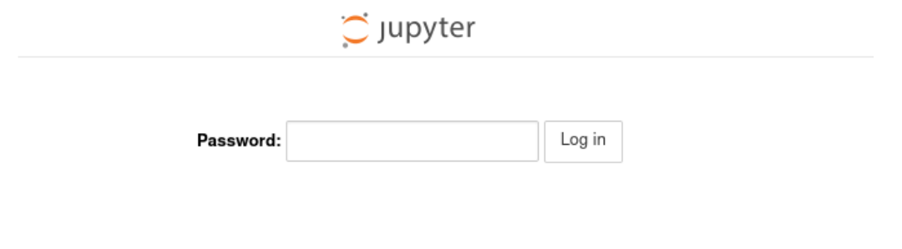

#Custom Jupyter Lab

*Updated on 15Mar2024*

## 0 User Support
If you need support for your application, please use this [link](https://www.recas-bari.it/index.php/en/recas-bari-servizi-en/support-request) to create a ticket with title “ReCaS HPC/GPU: Jupyter Lab support” and then describe your issue.


**It is STRONGLY advised to subscribe to the recas-hpu-gpu mailing list. Create a ticket with the title “ReCaS HPC/GPU: subscribe to the mailing list”.**

## 1 Introduction
The Jupyter Lab is an open-source web application that allows you to create and share documents that contain live code, equations, visualizations and narrative text.
Uses include: data cleaning and transformation, numerical simulation, statistical modelling, data visualization, machine learning, and much more.
Through Jupyter Lab, you can access your files and directories stored in the ReCaS-Bari GPFS file system and browse graphically, as shown in the following figure.

The ReCaS Jupyter Lab instances are based on the [RAPIDS Docker container](https://hub.docker.com/r/rapidsai/rapidsai/).

The Jupyter Lab instance **MUST BE** used **ONLY** for the developing phase. As soon as the code/analysis works, users are encouraged to use the [Job Orchestration service](https://jvino.github.io/cluster-hpc-gpu-guides/job_submission/chronos/).

!!! note
    Every Jupyter Lab instance on HPC/GPU cluster is allowed **ONLY** for a month. After, the instance will be killed. An email will be sent a week before. To extend the period of usage, create a ticket using this [link](https://www.recas-bari.it/index.php/en/recas-bari-servizi-en/support-request) with title “ReCaS HPC/GPU: Jupyter Lab instance - Time extension request” and describe a valid reason for extension of time.

## 2 Who can request this instance?

An instance of JupyterLab with a dedicated GPU but be requested formally, and will be accepted only with a **STRONG** motivation.

## 3 Service request
Jupyter Lab on HPC/GPU cluster is available only for those users with a ReCaS-Bari HPC/HTC account active. Users without such an account MUST register using this [link](https://www.recas-bari.it/index.php/en/recas-bari-servizi-en/richiesta-credenziali-2) (check the box "**Account for access to ReCas-Bari compute services (HTC/HPC)**").

You can check if the registration is successfully completed by access to the `frontend.recas.ba.infn.it` server via ssh:

`ssh <username>@frontend.recas.ba.infn.it`

After that, you can request your personal Jupyter Lab instance using this [link](https://www.recas-bari.it/index.php/en/recas-bari-servizi-en/support-request).

Please provide the following information:

```bash
Title: “ReCaS HPC/GPU: Jupyter Lab instance request”
Issue:
- Name and Surname
- Username
- Email
- number of required CPU
- number of required GPU
- amount of RAM
- hashed password
- other info, if you believe could be useful (like python version)
```

!!! note
    Please identify only the resource you need (we don't have infinite resources for all users!)

Once the request will be approved, you will receive an email containing your URL to use to access the remote Jupyter Lab.

In the following image, you can see the login web page. Insert your password used during the creation of hashed password (Next section).



!!! warning "IMPORTANT" 
    **DO NOT SHARE** your password. People knowning hostname, port and password have access to your home directory with delete permission.

### 3.1 Preparing a hashed password
You can prepare a hashed password manually.

Open a shell, install the notebook python module (pip3 install notebook) and type the following lines in a python shell:

```bash
[root@your-machine ~]# python3
>>> from jupyter_server.auth import passwd
>>> passwd()
Enter password:
Verify password:
'argon2:$argon2id$v=19$m=10240,t=10,p=8$+Gzqn+ZgyvjrXo9eJTIe3w$z0fzG6RZgSbcSXkCAYb3vw'
```

Finally, save the string `'argon2:$argon2id$v=19$m=10240,t=10,p=8$+Gzqn+ZgyvjrXo9eJTIe3w$z0fzG6RZgSbcSXkCAYb3vw'`

And provide it among the required information.

For reference, the [official web page](https://jupyter-notebook.readthedocs.io/en/stable/public_server.html#preparing-a-hashed-password).

## 4 Important information

Your instance of Jupyter notebook is executed inside a container and **ONLY** the files stored in your HOME directory in the ReCaS-Bari GPFS file system will be preserved if faults occur, namely /lustrehome. Any local file content or module installation are lost if the container is stopped or crashes. So, use the GPFS file system for all your important files.

**Containers could crash at any time also during the execution of the code**, partial results CAN NOT be restored and will be lost. To manage this situation, consider storing in your HOME directory in GPFS all partial results.

Also consider that you do not have infinite space in the GPFS file system. Use it wisely.

Delete files using Jupyter Lab will create a *.Trash* hidden folder in your HOME directory. To remove completely files, please access using SSH to `frontend.recas.ba.infn.it`. The content of the *.Trash* folder contribute to your quota.
