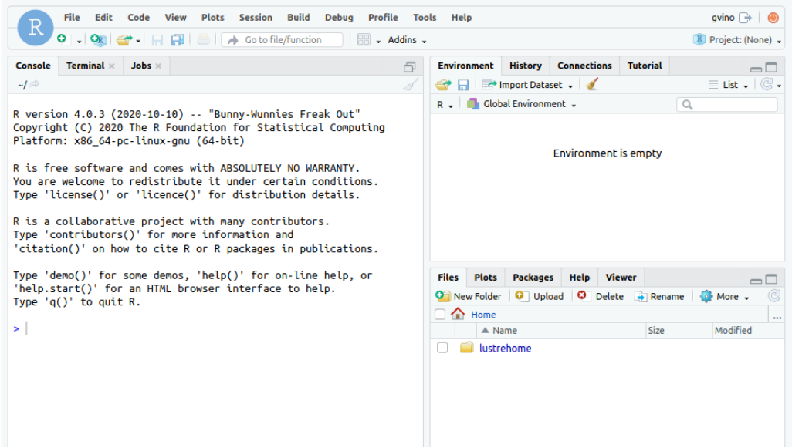
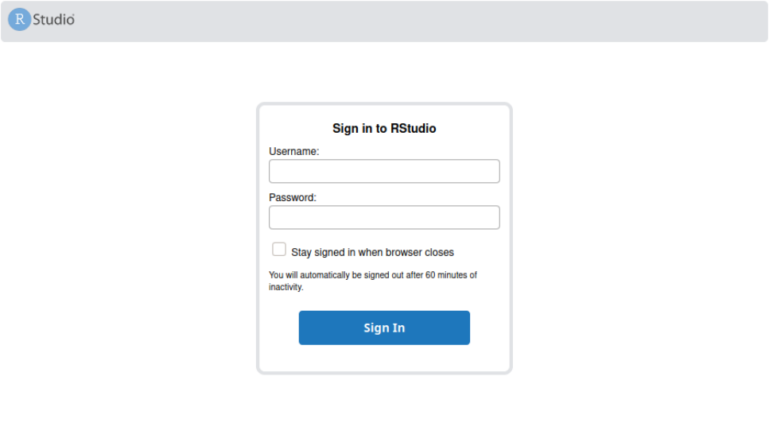

#RStudio

*Updated on 08Jan2026*	

## 0) User Support
If you need support for your application, please use this [link](https://www.recas-bari.it/index.php/en/recas-bari-servizi-en/support-request) to create a ticket with title “ReCaS RStudio support” and then describe your issue.
It is important insert in the ticket **YOUR USERNAME** used to access to the ReCaS Services.

### Keep you updated!
If you need support for your application, please use this [link](https://www.recas-bari.it/index.php/en/recas-bari-servizi-en/support-request) to create a ticket with title “ReCaS HPC/GPU: JupyterHub support” and then describe your issue.

**It is STRONGLY advised to subscribe to the recas-hpu-gpu mailing list. Create a ticket with the title “ReCaS HPC/GPU: subscribe to the mailing list”.**

Important messages will be sent ONLY using the mailing list.

## 1 Introduction
RStudio is an Integrated Development Environment (IDE) for R, a programming language for statistical computing and graphics. ReCaS-Bari provides RStudio Server that runs on a remote server and allows accessing RStudio using any web browser.

The following figure shows the provided IDE you can access using your web browser.



In the bottom right section you are able to browse graphically your HOME directory located in the ReCaS-Bari GPFS file system.

## 2 Service Request
Rstudio on HPC/GPU cluster is available only for those users with a ReCaS-Bari HPC/HTC account active. Users without such an account MUST register using this [link](https://www.recas-bari.it/index.php/en/recas-bari-servizi-en/richiesta-credenziali-2) (check the box "**Account for access to ReCas-Bari compute services (HTC/HPC)**").

You can check if the registration is successfully completed by access to the `frontend.recas.ba.infn.it` server via ssh:

`ssh <username>@frontend.recas.ba.infn.it`

After that, you can request your personal RStudio instance using this [link](https://www.recas-bari.it/index.php/en/recas-bari-servizi-en/support-request).

### 2.1 GPU request

GPUs are a valuable resource, so we only grant them when strictly necessary and when there is ready-to-use code that runs on CPUs and only needs to be adapted and executed on GPUs.

Only one GPU can be requested at a time. 
The request must provide a justification for using a GPU and explain why CPUs are not sufficient.

If the GPU request is approved, it will be granted for one month only. 
At the end of this period, the user must send an additional request (by email) to extend the service usage for another month. 
If this request is not approved or if the user does not send an email, the instance will be terminated without notice.

### 2.2 Request format

Please provide the following information:

```bash
Title: “ReCaS HPC/GPU: RStudio instance request”
Issue:
- Name and Surname
- Username
- Email
- number of required CPU: allowed values [1, 2, 4, 8, 16]
- GPU: allowed values [0, 1]
- amount of RAM: allowed values [4GB, 8GB, 16GB, 32GB, 64GB]
- other info, if you believe could be useful
```

After that you will receive an email to the same address containing your URL to use to access the remote Rstudio Server.

The following image shows you the RStudio login web page. Use your ReCaS username and password to access.



## 3 Important information
- Your instance of RStudio is executed inside a container and **ONLY** the files stored in your HOME directory in the ReCaS-Bari GPFS file system will be preserved if faults occur, namely /lustrehome. Any local file content or module installation is lost if the container is stopped or crashes. So, use the GPFS file system for all your important files.

- **Containers could crash at any time also during the execution of the code**, partial results CAN NOT be restored and will be lost. To manage this situation, consider storing in your HOME directory in GPFS all partial results.

- Also consider that you do not have infinite space in the GPFS file system. Use it wisely.

## 4 User Support
If you need support for your application, please use this [link](https://www.recas-bari.it/index.php/en/recas-bari-servizi-en/support-request) to create a ticket with title “ReCaS HPC/GPU: RStudio support” and then describe your issue.

!!! tip
    It is **STRONGLY** advised to subscribe to the recas-hpu-gpu mailing list. Create a ticket with the title “ReCaS HPC/GPU: subscribe to the mailing list”.
