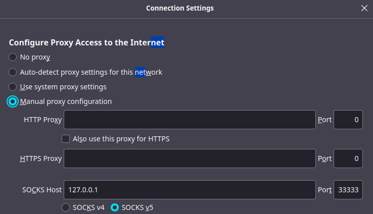

#Job orchestrator with Chronos

*Updated on 19Apr2022*	

## 1 Introduction
Chronos is the tool used to submit jobs to the ReCaS-Bari HPC/GPU cluster.

> **ONLY** Docker containers can be executed in the cluster.


You can run a third party Docker container or you can build your custom one. Please refer to the guide at this [link](https://jvino.github.io/cluster-hpc-gpu-guides/guides/docker_and_dockerfile/) for more details.

## 2 Request your personal ReCaS Chronos instance
Chronos is available only for users with a ReCaS-Bari HPC/HTC account active. Users without such an account MUST register using this [link](https://www.recas-bari.it/index.php/en/recas-bari-servizi-en/richiesta-credenziali-2) (check the box "**Account for access to ReCas-Bari compute services (HTC/HPC)**").

You can verify if the registration is successfully completed by access to the **frontend.recas.ba.infn.it** server via ssh:

```bash

	ssh <username>@frontend.recas.ba.infn.it
```

After that, you can request your personal Chronos instance using this [link](https://www.recas-bari.it/index.php/en/recas-bari-servizi-en/support-request).

Please provide the following information:


```bash
Title: “ReCaS HPC/GPU: new Chronos instance request”
Issue: Name, Surname, username, email
```

## 3 Chronos Web Interface
Chronos provdes a simple and fast web interface as shown in the following figure.


Through the web interface is possible to verify your job status. Moreover, it can be used to submit scheduled or dependent jobs.


## 3.1 Submit a job using the Web Interface
The web interface provides the possibility to submit a job by clicking on the “ADD JOB”. The following figure shows the box where you can insert all job parameters.


After adding the job, if the requested resources are available, the job is started. Otherwise the job is put in the queued state.

The following image shows the status of a job.


The boxes on the right allow to start again the job, edit the job description, stop and delete a job, respectively.

## 3.2 Submit the job using the terminal
Although submitting jobs through the web interface might seem easier at first, it could be not comfortable, scalable and fast. Submitting jobs using the terminal is **RECOMMENDED**.

This method requires a JSON file containing all the job information and the execution of a command that transmits the job information to your personal Chronos instance. Following an example of a JSON file. Insert the information of your specific job and save the file.

```bash
{
	"name": "<detailed-and-unique-job-name>",
	"command": "python3.6 </lustre/path/to/your/code>",
	"shell": true,
	"retries": 2,
	"description": "",
	"cpus": 4,
	"disk": 10,
	"mem": 8192,
	"gpus": 1,
	"environmentVariables": [],
	"arguments": [],
	"runAsUser": "<your-username>",
	"owner": "<your-username>",
	"ownerName": "<your-username>",
	"container": {
		"type": "mesos",
		"image": "<your-container-image>",
		"volumes": [{"containerPath": "/lustre/path/to/your/home-directory>", 
			         "hostPath": "/lustre/path/to/your/home-directory", 
             		 "mode": "RW"}]
    },
	"schedule": "R1//P1Y"
}
```

!!! note 
    - It’s important to insert an unique **name** for each submitted job, this will be important during the debugging phase. The name should **ALWAYS** start with your **username**. Insert dash ( - ) between words. Es “myuser-test-job-1-date-2020-09-34”.
    - The **command** field is specific for each application, what written in the example will not work in your use case. Absolute path is preferred.
    - **<your-username\>** is the user created during the registration.
    - **<your-container-image\>** is the container image name to use for your application.
    - The **schedule** field is used to type how many times you want to execute the job and the period among execution, please refer to this [guide](https://mesos.github.io/chronos/docs/api.html) (Adding a Scheduled Job - section) if you need it otherwise leave it as you see in the example.

The command used to submit the job is based on CURL. On a machine with a Linux OS, open a file editor and copy the following lines inside and save it (e.g. with the “submit-to-chronos” name).

```bash
#!/bin/bash
FILE=$1
USERNAME=<your-username>
PASSWORD=XXXX
HOSTNAME=XXXX
PORT=XXXX
curl -u $USERNAME:$PASSWORD -L -H 'Content-Type: application/json' -X POST --data-binary "@$FILE" http://$HOSTNAME:$PORT/v1/scheduler/iso8601
```

Once the request will be approved, the administrator will provide **PASSWORD**, **HOSTNAME** and **PORT** by email.

To submit the job, execute the following command (supposing the json file name is “*job.json*” and the submit command file name is “submit_chronos”)

```bash
bash ./submit_chronos job.json
```

!!! note
    Since your Chronos instance is not accessible from outside, the unique procedure to submit job is to store json files and the script used to submit jobs in your home directory on frontend.recas.ba.infn.it (officially the ReCaS-Bari storage based on GPFS) and execute the command from there.

## 3.3 User Support
For any problem related to the Chronos service, use this [link](https://www.recas-bari.it/index.php/en/recas-bari-servizi-en/support-request) for create a support request, inserting as title “ReCaS HPC/GPU: Chronos issue”, then describe the problem in the issue box. Your username and job\_name **MUST** be added.

At the moment, users can not access to the job logs. For support on a specific job, submit a support request providing the username, job\_name and describing the problem in the issue box.

!!! note
    It is STRONGLY advised to subscribe to the recas-hpu-gpu mailing list. Create a ticket with title “ReCaS HPC/GPU: subscribe to the mailing list”.

## 3.4 Access to the Chronos Web Interface

In order to access your Chronos instance is needed to create a SSH SOCKS Tunnel. **Firefox is mandatory**, please install it.

The procedure to access to the Chronos instance through the SSH SOCKS Tunnel is composed of 2 steps:

1. Open a shell and execute the following command and **DO NOT CLOSE IT**:
```bash
   ssh -D 33333 <username>@frontend.recas.ba.infn.it
```
1. Open Firefox then:
    1. Settings" -> "Network Settings" -> check "Manual proxy configuration"
    1. Insert in the field "SOCKS Host" ->  "127.0.0.1" and Port -> "33333"
    1. Check SOCKS v5
    1. Close
1. Access your Chronos instance using the URL

The following figure shows the firefox network settings


## 4 Example

The following JSON could be used as first test by the user.

```bash
{
  "name": "<username>-my-first-job-submission",
  "command": "sleep 5 && nvidia-smi",
  "shell": true,
  "retries": 4,
  "description": "",
  "cpus": 1,
  "disk": 0,
  "mem": 1024,
  "gpus": 1,
  "environmentVariables": [],
  "arguments": [],
  "runAsUser": "<username>",
  "owner": "<username>",
  "ownerName": "<username>",
  "container": {
    "type": "mesos",
    "image": "registry-clustergpu.recas.ba.infn.it/gvino/cuda11.5.0-base-ubuntu20.04:0.1"
  },
  "schedule": "R1//P1Y"
}
```

Save it as "*my-first-job.json*" on your personal computer and send this file and that used to submit the job to your home in the ReCaS-Bari Storage using the command:

```bash
scp ./my-first-job.json submit_chronos <username>@frontend.recas.ba.infn.it:
```

Then access to your storage using:

```bash
ssh <username>@frontend.recas.ba.infn.it:
```

Finally, submit the job using the command:

```bash
bash submit_chronos my-first-job.json
```

Go to the web inteface to verify whether the job was successfully submitted and executed.


