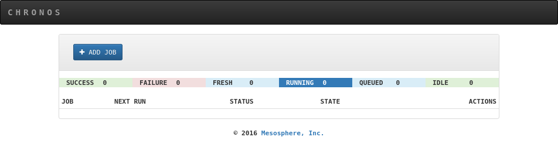
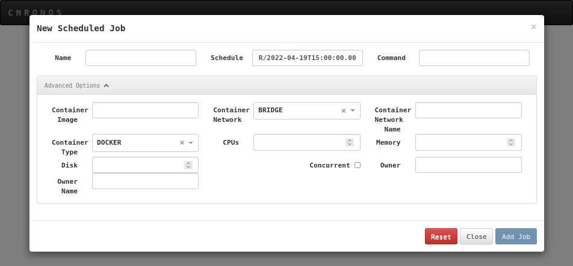
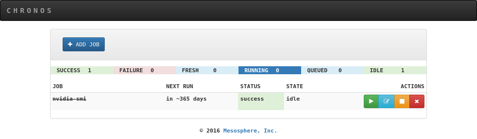

#Job orchestrator with Chronos

*Updated on 19Apr2022*	

## 1 Introduction
**Chronos is the tool used to submit jobs to the ReCaS-Bari HPC/GPU cluster.**

**IMPORTANT**: ONLY Docker containers can be executed in the cluster.

You can use already built docker container or you can build your custom container. Please refer to the guide at this [link](https://jvino.github.io/cluster-hpc-gpu-guides/guides/docker_and_dockerfile/) for more details.

## 2 Access to the ReCaS Chronos instance
Chronos is available only for those users with a ReCaS-Bari HPC/HTC account active. Users without such an account MUST register using this [link](https://www.recas-bari.it/index.php/en/recas-bari-servizi-en/richiesta-credenziali-2) (check the box "**Account for access to ReCas-Bari compute services (HTC/HPC)**").

You can check if the registration is successfully completed by access to the **frontend.recas.ba.infn.it** server via ssh:

```bash

	ssh <username>@frontend.recas.ba.infn.it
```

After that, you can request your personal Chronos instance using this [link](https://www.recas-bari.it/index.php/en/recas-bari-servizi-en/support-request).

Please provide the following information:


```bash
Title: “ReCaS HPC/GPU: new Chronos instance request”
Issue: Name, Surname, username, email
```

Once the request will be approved, the administrator will provide hostname, port and authentication information in order to access your personal Chronos instance.

## 3 Chronos web interface  
Using the URL provided by the administrator of the service in the browser, it is possible to access the Chronos web interface as shown in the following figure.



The web interface is the unique way to check your job status. Moreover, it can be used to submit scheduled or dependent jobs.

!!! note 
    To access your web interface, please, follow instructions in section 4.

## 3.1 Submit a job using the web interface
Clicking on the “ADD JOB” box you submit a job. The following figure shows the box where you insert all parameters needed to submit a job.



After adding the job, if the requested resources are available, the job is started. Otherwise the job is put in the queued state.

The following image shows the status of a job.



Using the box on the right, you can start the job again, edit the job description, stop and delete a job, respectively.

**IMPORTANT:** The job name MUST be unique and start with your username, always. This must be provided when you will describe the problem in a support request. Using this [link](https://www.recas-bari.it/index.php/en/recas-bari-servizi-en/support-request) for support requests, inserting as title “ReCaS HPC/GPU: Chronos issue”, then describe the problem in the issue box, where your username and job\_name must be added.
## 3.2 Submit the job using the terminal
Although, submitting jobs through the web interface might seem easier at first, it could be not comfortable, scalable and fast. Submitting jobs using the terminal is advised.

This method requires a JSON file containing all the job information and the execution of a command that transmits the job information to your personal Chronos instance. Following an example of a JSON file. Insert the information of your specific job and save the file.

```bash
{
	"name": "<detailed-and-unique-job-name>",
	"command": "python3.6 </lustre/path/to/your/code>",
	"shell": true,
	"retries": 2,
	"description": "",
	"cpus": 4,
	"disk": 10,
	"mem": 8192,
	"gpus": 1,
	"environmentVariables": [],
	"arguments": [],
	"runAsUser": "<your-username>",
	"owner": "<your-username>",
	"ownerName": "<your-username>",
	"container": {
		"type": "mesos",
		"image": "<your-container-image>",
		"volumes": [{"containerPath": "/lustre/path/to/your/home-directory>", 
			         "hostPath": "/lustre/path/to/your/home-directory", 
             		 "mode": "RW"}]
    },
	"schedule": "R1//P1Y"
}
```

!!! note 
- It’s important to insert an unique **name** for each submitted job, this will be important during the debugging phase. The name should **ALWAYS** start with your **username**. Insert dash ( - ) between words. Es “myuser-test-job-1-date-2020-09-34”.
- The **command** field is specific for each application, what written in the example will not work in your use case. Absolute path is preferred.
- **<your-username>** is the user created during the registration.
- **<your-container-image>** is the container image name to use for your application.
- The **schedule** field is used to type how many times you want to execute the job and the period among execution, please refer to this [guide](https://mesos.github.io/chronos/docs/api.html) (Adding a Scheduled Job - section) if you need it otherwise leave it as you see in the example.

The command used to submit the job is based on CURL. On a machine with a Linux OS, open a file editor and copy the following lines inside and save it (e.g. with the “submit-to-chronos” name).

```bash
#!/bin/bash
FILE=$1
USERNAME=<your-username>
PASSWORD=XXXX
HOSTNAME=XXXX
PORT=XXXX
curl -u $USERNAME:$PASSWORD -L -H 'Content-Type: application/json' -X POST --data-binary "@$FILE" http://$HOSTNAME:$PORT/v1/scheduler/iso8601
```

**PASSWORD**, **HOSTNAME** and **PORT** variables will be sent by email.

To submit the job, execute the following command (supposing the json file name is “job.json” and the submit command file name is “submit-to-chronos.sh”)

```bash
chmod 755 submit-to-chronos (only once)
./submit-to-chronos job.json
```

## 4 Interacting with Chronos
**IMPORTANT**: Chronos instance is not accessible from outside.

**IMPORTANT**: The unique procedure to submit job is to store json files and the script used to submit jobs in your home directory on frontend.recas.ba.infn.it (officially the ReCaS-Bari storage based on GPFS) and execute the command from there.

**IMPORTANT**: In order to access your Chronos instance is needed to create a SSH SOCKS Tunnel. **Firefox is mandatory**, please install it.

The procedure to access to the Chronos instance through the SSH SOCKS Tunnel is composed of 2 steps:

1. Open a shell and execute the following command and do not close the shell 
```bash
   ssh -D 33333 <username>@frontend.recas.ba.infn.it
```
1. Open Firefox then
   1. Settings" -> "Network Settings" -> check "Manual proxy configuration"
   1. Insert in the field "SOCKS Host" ->  "127.0.0.1" and Port -> "33333"
   1. Check SOCKS v5
   1. Close
2. Access your Chronos instance using the URL

## 4 User Support
If you need support for your application, please use this [link](https://www.recas-bari.it/index.php/en/recas-bari-servizi-en/support-request) to create a ticket with title “ReCaS HPC/GPU: Chronos support” and then describe your issue. In case the issue is related to a job, in the description MUST be inserted the job name.

It is STRONGLY advised to subscribe to the recas-hpu-gpu mailing list. Create a ticket with title “ReCaS HPC/GPU: subscribe to the mailing list”.
