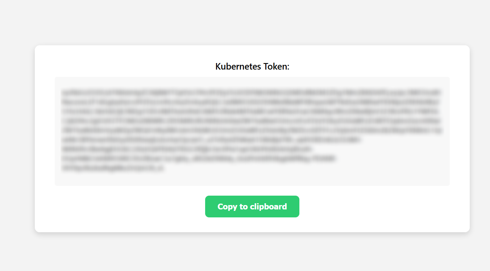

# Job submission using Kubernetes

## IMPORTANT: User Support
If you need support, please use [this link](https://www.recas-bari.it/index.php/en/recas-bari-servizi-en/support-request) to submit a ticket with title “ReCaS HPC/GPU: Kubernetes support” and then describe your issue.

**It is STRONGLY advised to subscribe to the recas-hpc-gpu mailing list. Create a ticket with the title “ReCaS HPC/GPU: subscribe to the mailing list”.**

Important messages will be sent ONLY using the mailing list.


## 1) Introduction

Kubernetes (K8s) is the tool used to submit jobs to the ReCaS-Bari HPC/GPU cluster.

> **Note**  
> **ONLY** containers can be executed in the cluster.

You can run a third party container or you can build your custom one. Please refer to the guide at [this link](https://jvino.github.io/cluster-hpc-gpu-guides/guides/docker_and_dockerfile/) for more details on the latter.


## 2) Access to the service 

Access to our HPC/GPU Kubernetes Cluster is available only for users with a ReCaS-Bari HPC/HTC account active. Users without such an account **MUST** register using [this link](https://www.recas-bari.it/index.php/en/recas-bari-servizi-en/richiesta-credenziali-2) (check the box "**Account for access to ReCas-Bari compute services (HTC/HPC)**").  
Once your request has been submitted, it must be approved by the service manager. This process typically takes a couple of working days. You will receive an automatic email notification as soon as your account is activated.

Once activated, you can verify if the registration is successfully completed by accessing the **frontend.recas.ba.infn.it** server via ssh:


`ssh <your-username>@frontend.recas.ba.infn.it`


After that, you can request access to the Kubernetes service using [this link](https://www.recas-bari.it/index.php/en/recas-bari-servizi-en/support-request).

Please provide the following information:


```
   Title: “ReCaS HPC/GPU: request to access HPC/GPU K8s cluster”  
   Issue:
   - Name and Surname
   - HTC/HPC service username
   - Email  
```


## 3) Configuring access to the Kubernetes cluster

This section explains how to set up the **kubectl** command-line tool to access the ReCaS HPC/GPU Kubernetes cluster, after your access request has been approved—that is, once you’ve received a positive response to the ticket titled "**ReCaS HPC/GPU: request to access HPC/GPU K8s cluster**" as described in [Section 2](#2-access-to-the-service).

### 3.1) kubectl

Interaction with a Kubernetes (K8s) cluster happens through an API server. Any action you perform — whether monitoring resources, deploying workloads or checking logs — ultimately goes through this server, which listens for HTTPS requests.

While you could technically interact with the API server using tools like **curl**, it's far easier and more efficient to use a dedicated CLI tool: [kubectl](https://kubernetes.io/docs/reference/kubectl/).  
**kubectl** is the official Kubernetes command line client, designed to communicate with the cluster's API server in a user-friendly way. It offers commands for inspecting resources, deploying applications, scaling workloads and more.

The tool is already installed on the ReCaS frontend (**frontend.recas.ba.infn.it**) and can also be [easily installed on your local machine](https://kubernetes.io/docs/tasks/tools/install-kubectl-linux/) if needed. Please note that, in case of local installation, you should use **version 1.30.0** to ensure compatibility. Using a different version may lead to issues.

To configure **kubectl** for access to the ReCaS Kubernetes cluster — either from the frontend or from your own system — you’ll need to create a configuration file with the correct cluster and authentication details.  

**kubectl** is configured to look for its configuration file at the path **.kube/config** within the home directory of the user executing the command. To set this up, begin by creating the **.kube** directory:


`mkdir ~/.kube`


Then, using your preferred text editor (**vim**, **nano**, **emacs**, etc.),  create the **~/.kube/config** file and paste the following template into it:


```
apiVersion: v1
kind: Config
preferences: {}
clusters:
- name: default
  cluster:
    server: https://k8s.recas.ba.infn.it:443

contexts:
- name: oidc-user-context
  context:
    cluster: default
    user: oidc-user
    namespace: batch-<your-frontend-username>

current-context: oidc-user-context

users:
- name: oidc-user
  user:
    token: 
```


The only part that needs to be edited in this manifest is the section **contexts.name.context.namespace**. Replace **\<your-frontend-username\>** with your actual cluster username. So, for example, if you connect to the cluster with  


`ssh fdebiase@frontend.recas.ba.infn.it`  
then the namespace should be:  


`namespace: batch-fdebiase`


Once you’ve made these changes and saved the file, kubectl will automatically use this configuration by default whenever you run commands.

### 3.2) Access token

As you probably noticed, the last field of the text file you edited is an empty field called **token**. This field needs to be filled with a personal access token (of weekly expiration), which is required for authentication. 

#### Requesting the token
In order to get this token, you have to login using your frontend (HTC/HPC service) credentials at  
[https://auth-k8s.recas.ba.infn.it](https://auth-k8s.recas.ba.infn.it)

After the authentication procedure is complete, you will see on your browser page (see image below) a token string: it is an encoded object (JWT) with all the information Kubernetes needs to know in order to authenticate you whenever you try to make a request to the API server(s) using the **kubectl** tool.



#### Configure kubectl to use the token

Now that you have your token, update the **token:** field in the **users** section of your **kubectl** config file.  

So, supposing your token is '**JALPFNGBQLBVaaaQG**' the configuration file has to look like:


```
users:
- name: oidc-user
  user:
    token: JALPFNGBQLBVaaaQG
```


That’s it! Your configuration is now complete.


> **⚠️ IMPORTANT NOTE**  
> Your access token is **strictly personal**. You are fully responsible for any operations performed using your personal token.  
If you are using **kubectl** directly on the ReCaS HTCondor cluster frontend, ensure that your Kubernetes configuration file (which contains your token) has restrictive permissions—accessible only by you.
To enforce this, simply run the following command:   
`chmod 700 ~/.kube/config`  
This sets the file permissions to allow read, write, and execute access only for your user.


> **Note**  
> **Tokens are valid for 7 days**. When your token expires, **kubectl** commands will stop working with an error. To fix this, simply log in again at the URL above, retrieve a new token, and replace it in the config file. 


### 3.3) Verifying your setup

After your token is in place, for the next week (that is, until the token expires) you can directly interact with the Kubernetes cluster using **kubectl**.  
To check that everything is configured correctly, run:  


`kubectl get pod`  


If everything is working, you’ll see:  


`No resources found in batch-{yourUsername} namespace `  


This means your token is valid and kubectl can communicate with the cluster.   
Otherwise, if you get an error like:  


```Error from server (Forbidden): pods is forbidden: User "{yourUsername}" cannot list resource "pods" in API group "" in the namespace "batch-{yourUsername}"```  


then there might be a misconfiguration. Double-check the steps above; if the issue persists, [reach out to support](#important-user-support).


## 4) Jobs submission

This section explains how to submit a containerized workload as a Kubernetes Job to the ReCaS HPC/GPU cluster.

### 4.1) Jobs limitation

By default, users are subject to resource quotas, which limit the total amount of CPU cores, RAM and GPUs that can be requested. These limits apply across all your active jobs combined, not just to individual jobs.  
Currently, **each user is limited to a maximum of 80 CPU cores, 300 GB of RAM and 2 GPUs across all active jobs**.  
Additionally, **each individual job can run for a maximum of one week (24*7 hours)**. If the job exceeds this runtime, it will be automatically terminated by the system.  
If you believe your workload requires an exception to any of these limits, please [contact us](https://www.recas-bari.it/index.php/en/recas-bari-servizi-en/support-request) and describe your use case.

> **Note**  
> The cluster has a large — but still finite — pool of computing resources. If all available GPUs or other resources are already in use by other users, your job will not start immediately. Instead, Kubernetes will automatically schedule and launch it as soon as resources become available.
No need for manual retries: just submit your job and let the system handle the rest.   

### 4.2) Submit your first Kubernetes Job

Submitting a job is simple and flexible, but assumes your application is packaged as a Docker container.   
You can use third-party public images (e.g. from DockerHub) or build and push your own image to our private container image registry, as explained in [this guide](https://jvino.github.io/cluster-hpc-gpu-guides/guides/docker_and_dockerfile/#2-building-custom-docker-containers-in-recas-bari).  

 Please note that, once the job is running, you’ll be able to open a terminal inside the container, just like SSH access, allowing for full interaction with your running workloads.

#### Enough chit-chat, let's submit our Jobs!

Before submitting any job, ensure that you have configured **kubectl** and your access token is valid. See [Section 3: Configuring Access](#3-configuring-access-to-the-kubernetes-cluster) for details.

Create a text file (e.g., **my-job.yaml**) with the following content:


```
apiVersion: batch/v1
kind: Job
metadata:
  name: <job-name>
spec:
  ttlSecondsAfterFinished: 604800
  backoffLimit: 0
  template:
    spec:
#      runtimeClassName: nvidia
      containers:
      - name: <container-name>
        image: <container-image>
        command: ["sh", "-c", "<command_1>; <command_2>; <command_3>; ..."]
        resources:
          requests:
            cpu: "0.2"
            memory: "100Mi"
          limits:
            cpu: "<integer>"
            memory: "<integer>Gi"
            nvidia.com/gpu: 0
        volumeMounts:
        - name: lustre
          mountPath: /lustre
        - name: lustrehome
          mountPath: /lustrehome
      restartPolicy: Never
      volumes:
      - name: lustre
        hostPath:
          path: /lustre
          type: Directory
      - name: lustrehome
        hostPath:
          path: /lustrehome
          type: Directory
#      nodeSelector:
#        nvidia.com/gpu.product: Tesla-V100-PCIE-32GB
#        nvidia.com/gpu.product: NVIDIA-A100-PCIE-40GB
#        nvidia.com/gpu.product: NVIDIA-H100-80GB-HBM3
```


You’ll need to replace these placeholder values: 

**metadata.name**: A unique name for your Job;

<br>

**spec.backoffLimit**:  Specifies the number of retry attempts Kubernetes will make if the Job fails before giving up.  
Once the number of failures reaches this limit, the Job is marked as failed and will not be retried further.  
For most jobs, it makes sense to leave `backoffLimit: 0` as is — no need to restart the job upon failure.  
If needed, you can increase this value up to a maximum of 6 retry attempts. If the field is omitted, it will default to 6.

<br>

**spec.ttlSecondsAfterFinished**: Duration in seconds to retain the Job object in the cluster after it completes execution, either successfully or with an error. After this period, the Job is automatically deleted by the TTL controller.  
In this manifest, the value is set to one week (604800 seconds).  
This setting only affects the Job controller object, not the container lifecycle. The Pods created by the Job will still terminate as usual upon completion, the containers will not continue running during this TTL period. However, logs and information regarding the terminated Pods and Jobs remain accessible for as long as specified in this field.

<br>

**spec.template.spec.containers.name**: Arbitrary name for your container. In Kubernetes, a Job is an object that wraps one or more containers: that's why you need to specify both a name for the Job object and one for the container(s) the Job launches;

<br>

**spec.template.spec.containers.image**: Container image. In case it is a public one directly  from DockerHub you only need to specify the image name or link, so for example  

`image: ubuntu`  

or

`image: gcr.io/google-containers/pause:3.9`  

Otherwise, if you are launching a container with a custom image pushed in our private image registry, you need to specify it like  

`image: registry-clustergpu.recas.ba.infn.it/{yourUsername}/{yourImage}`    

So, for example  

`image: registry-clustergpu.recas.ba.infn.it/gvino/cuda11.5.0-base-ubuntu20.04:0.1`

<br>

**spec.template.spec.containers.resources.limits.cpu**, **spec.template.spec.containers.resources.limits.memory** and **spec.template.spec.containers.resources.limits.nvidia.com/gpu**: limits to the number of CPU cores, RAM in terms of Gibibytes (≈ Gigabytes) and number of GPU(s).  
The parameters under **resources.requests**, instead, define the minimum guaranteed amount of resources that the container will receive. For most use cases, the default values we have provided should be sufficient and typically don’t require adjustment.

<br>


**spec.template.spec.containers.command**: overrides the image 'ENTRYPOINT' field; This is typically where you want to put the command(s) to start the container with.  
For example, to execute `echo Starting job...` followed by `sleep 3600`:

`command: ["sh", "-c", "echo Starting job...; sleep 3600"]`  

<br>


**spec.template.spec.containers.args**: overrides the image 'CMD' field.


> **Note**  
> For a quick overview on the 'CMD' and 'ENTRYPOINT' fields of a container image, please check [this link](https://www.docker.com/blog/docker-best-practices-choosing-between-run-cmd-and-entrypoint/).

<br>

If your workload does not require a GPU, please leave `spec.runtimeClassName` and the entire `spec.nodeSelector` section commented out.  
If, instead, your workload does require the use of GPUs, change the `nvidia.com/gpu` limit and uncomment (just remove the '#' from the manifest and leave indentation as is) the `spec.runtimeClassName` field, the `nodeSelector:` line and **JUST** its subfield regarding the kind of GPU you are interested in using (whether a NVIDIA V100/A100/H100).  
Please note that your request can end up in error if you:  

- are not allowed to use that given kind of GPU;  
- are requesting GPUs and leaving the `runtimeClassName` and `nodeSelector` fields commented out.

For reference, here are two fully avvalorated examples for a Job not requesting a GPU (first manifest) and a Job requesting 2 NVIDIA A100 GPUs:

<br>

#### Example Job NOT requesting a GPU


```
apiVersion: batch/v1
kind: Job
metadata:
  name: documentazione-job
spec:
  backoffLimit: 0
  template:
    spec:
#      runtimeClassName: nvidia
      containers:
      - name: documentazione-job
        image: busybox
        command: ["sh", "-c", "echo Starting job...; sleep 3600"]
        resources:
          requests:
            cpu: "0.2"
            memory: "100Mi"        
          limits:
            cpu: "2"
            memory: "4Gi"
            nvidia.com/gpu: 0
        volumeMounts:
        - name: lustre
          mountPath: /lustre
        - name: lustrehome
          mountPath: /lustrehome
      restartPolicy: Never
      volumes:
      - name: lustre
        hostPath:
          path: /lustre
          type: Directory
      - name: lustrehome
        hostPath:
          path: /lustrehome
          type: Directory
#      nodeSelector:
#        nvidia.com/gpu.product: Tesla-V100-PCIE-32GB
#        nvidia.com/gpu.product: NVIDIA-H100-80GB-HBM3
#        nvidia.com/gpu.product: NVIDIA-A100-PCIE-40GB
```
<br>

#### Example Job requesting 2 NVIDIA A100 GPUs


```
apiVersion: batch/v1
kind: Job
metadata:
  name: documentazione-job
spec:
  backoffLimit: 0
  template:
    spec:
      runtimeClassName: nvidia
      containers:
      - name: documentazione-job
        image: busybox
        command: ["sh", "-c", "echo Starting job...; sleep 60"]
        resources:
          requests:
            cpu: "0.2"
            memory: "100Mi"        
          limits:
            cpu: "2"
            memory: "4Gi"
            nvidia.com/gpu: 2
        volumeMounts:
        - name: lustre
          mountPath: /lustre
        - name: lustrehome
          mountPath: /lustrehome
      restartPolicy: Never
      volumes:
      - name: lustre
        hostPath:
          path: /lustre
          type: Directory
      - name: lustrehome
        hostPath:
          path: /lustrehome
          type: Directory
      nodeSelector:
#        nvidia.com/gpu.product: Tesla-V100-PCIE-32GB
#        nvidia.com/gpu.product: NVIDIA-H100-80GB-HBM3
        nvidia.com/gpu.product: NVIDIA-A100-PCIE-40GB
```


Once your manifest is ready and saved (e.g. as **my-job.yaml**), submit it to the Kubernetes cluster with:  


`kubectl create -f /path/to/file`  


so, for example  


`kubectl create -f my-job.yaml`


Kubernetes will validate the manifest and either start the job immediately (if resources are available), queue it for execution when the required resources become free or return an error if the file is incorrectly written.

> **Note**  
> So far, we've simplified things by saying that a Kubernetes **Job** is a wrapper around a container. That’s not entirely accurate.  
In Kubernetes, the smallest deployable unit is the **Pod**—not the container itself. A Pod typically wraps one container (or sometimes more) and provides the execution environment for it.
A Job, in turn, is a controller that manages the lifecycle of one or more Pods and ensures that a specified task completes successfully. For example, it can enforce a maximum runtime for the underlying Pod.  
In practical terms: when you submit a Job to the cluster, Kubernetes creates a Pod, and that Pod runs the container you defined for your workload.  
We won’t dive deeper into the details of Pods in this guide, as they’re not essential for day-to-day usage. However, if you're curious, you can read more in the [official Kubernetes documentation](https://kubernetes.io/docs/concepts/workloads/pods/). 


### 4.3) Submitting more than a Job / Resubmitting the same job

In Kubernetes, the unique identifier for an object is its name, combined with the namespace it resides in. Since each user operates within their own dedicated namespace, only one object of a given type (e.g., a Job) with a specific name can exist at a time within that namespace.

This means that in order to submit multiple Jobs starting from the same manifest file, you must either change the **metadata.name** field of the Job in the YAML definition for each submission, ensuring uniqueness, or delete the previous Job before re-submitting a new one with the same name:


```
kubectl delete -f /path/to/job/definition.yaml
kubectl create -f /path/to/job/definition.yaml
```


### 4.4) Shared storage

In the Job manifest file, you might have noticed the following section:


```
        volumeMounts:
        - name: lustre
          mountPath: /lustre
        - name: lustrehome
          mountPath: /lustrehome
      restartPolicy: Never
      volumes:
      - name: lustre
        hostPath:
          path: /lustre
          type: Directory
      - name: lustrehome
        hostPath:
          path: /lustrehome
          type: Directory
```


This configuration ensures that the shared storage available on the ReCaS frontend (**frontend.recas.ba.infn.it**) is also mounted inside your container.  
As a result, all the files you see on the frontend (under **/lustre** and **/lustrehome**) will also be accessible from within your running container—automatically.  
Any changes you make to files within these mounted paths from inside the container — such as creating, editing, or deleting files — will be immediately reflected on the actual storage on the frontend.
In practice, it’s as if you were working directly on the frontend itself, but within an isolated container environment.

> **Note**  
> Proper file permissions and access control are enforced. So don’t try anything sneaky — you will only be able to access files and directories you are authorized to.

### 4.5) Monitoring and Debugging Submitted Jobs

Just because your **kubectl create** command doesn't return an error doesn't mean the Job actually ran successfully.   
To monitor the state of your Job and the underlying Pod, use the following commands: 

- List your pods:   


&nbsp;&nbsp;&nbsp;&nbsp;&nbsp;`kubectl get pod`

- Describe a specific pod (helpful to debug scheduling issues or container errors): 


&nbsp;&nbsp;&nbsp;&nbsp;&nbsp;  `kubectl describe pod <podName>`

- Check logs from the pod (only available after the container starts running): 


&nbsp;&nbsp;&nbsp;&nbsp;&nbsp;  `kubectl logs <podName>`

- List your jobs:  


&nbsp;&nbsp;&nbsp;&nbsp;&nbsp;  `kubectl get job`  

- Inspect job details:  


&nbsp;&nbsp;&nbsp;&nbsp;&nbsp;  `kubectl describe job <jobName>`

These commands will help you identify what went wrong, whether the container failed to start, exited early or encountered runtime errors.

### 4.6) Opening a terminal into a container

If your job is running and you want to interact directly with the container — for example to run commands, inspect files or debug issues — you can run a command inside it using:  


`kubectl exec -it <podName> -- <command>`  

> **Note**  
> If your pod has more than one container, you will also need to specify which container you want to access:  
`kubectl exec -it <podName> -c <containerName> -- <command>`


A common use case may be running a terminal inside your container. If the **bash** shell is installed inside the container:  


`kubectl exec -it <podName> -- bash`   


if instead **bash** is not present in the image you can try with  


`kubectl exec -it <podName> -- sh`  


### 4.7) Deleting a job

If you submitted a job by mistake, or if you noticed there is something wrong with your workload, you can delete a Job manually to free up cluster resources and keep your environment clean.  

There are two main ways to delete a Job:  


`kubectl delete job <job-name>`  


or  


`kubectl delete -f /path/to/Job/definitionFile`  


e.g.  


`kubectl delete -f my-job.yaml`


Both of these approaches will also delete the associated Pod(s) created by that Job.  

> **Note**  
> Of course, deleting a Job does not delete any files that may have been written to the shared volumes like **/lustre** or **/lustrehome**. Any data you write to these directories from within the container is persisted — just as if you were working directly on the frontend.


